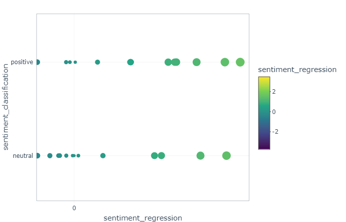
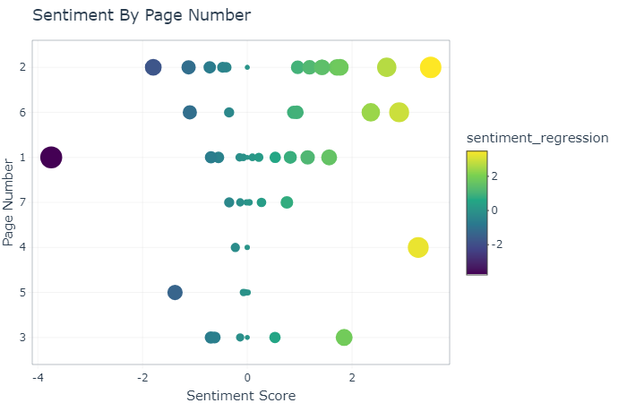

# Sentiment-Analysis-API

**Database of train** 
[FinancialPhraseBank-v1.0](https://www.researchgate.net/publication/251231364_FinancialPhraseBank-v10)

**Models** 

-Linear regression / Logistic regression

**Package Dependencies:** 

**How to reproduce**
1- Download Postman 
2- Run the script 'run_api.R'
3- Copy 'RawText.json' into the body of POST request select raw and JSON options!
4- Set URL to "http://127.0.0.1:8000/GLM" for Sentiment Polarity and "http://127.0.0.1:8000/LR" for Sentiment Intensity
5- Hit "Send"

**Screenshot:**

